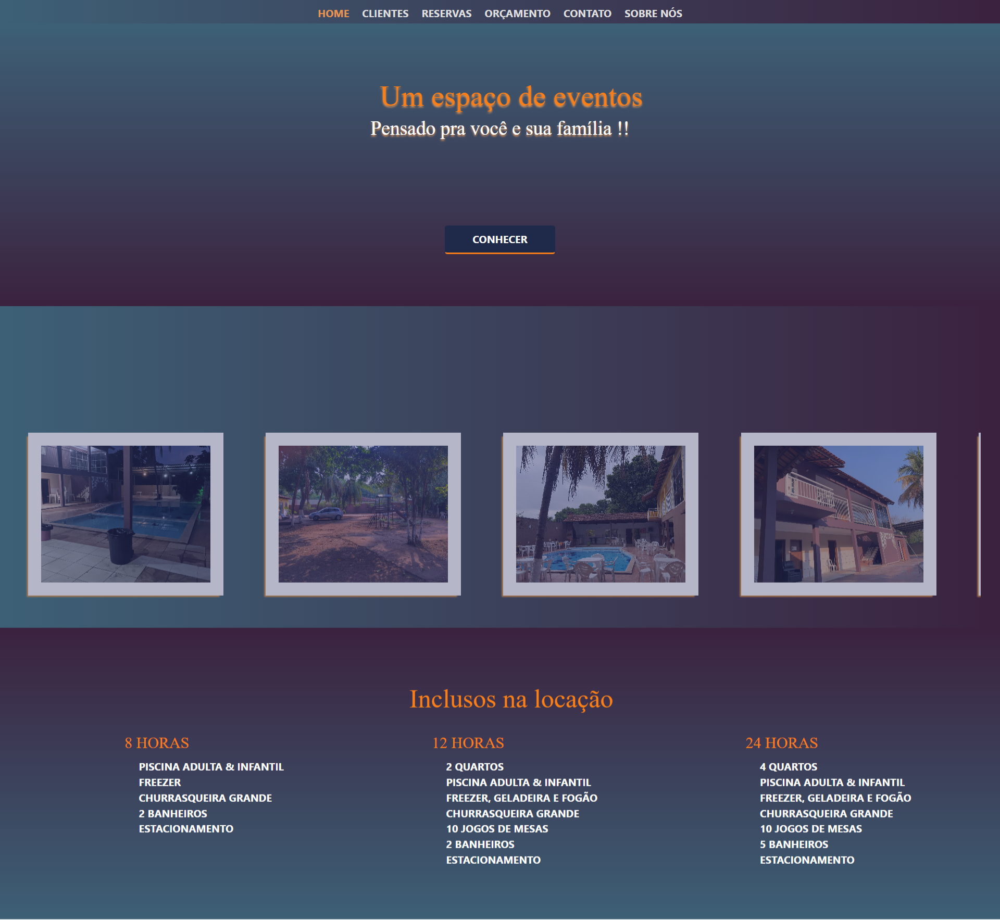

#### ChacaraWeb

- Projeto consiste em um sistema de controle de reservas e clientes de um espaço de eventos.

- Permite cadastrar, atualizar, deletar e listar + detalhes.

- Integração com API Rest feita em Java Spring

- Angular Generics

- Framework Angular 13

#### Requisitos

- Angular cli

- Nodejs

#### Inicializar projeto localmente

- npm install

- npm start

- Acessar localhost:4200 no navegador

#### PRINT DA HOME
